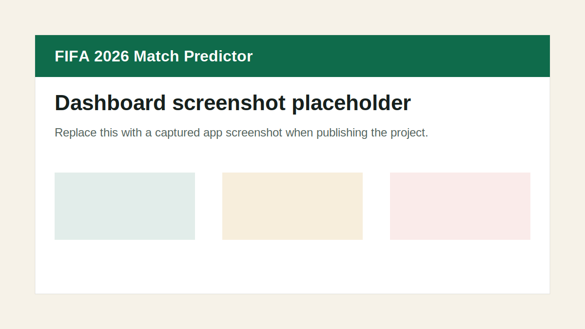

# FIFA 2026 Knockout Predictor



Portfolio-quality MVP for predicting FIFA World Cup 2026 knockout-stage outcomes with a Flask API, PostgreSQL, raw SQL migrations, psycopg 3, and a React analytics dashboard.

## Tech Stack

- Backend: Python 3.10+, Flask, Flask-CORS, psycopg 3, pandas, scikit-learn, pytest
- Database: PostgreSQL, raw SQL migrations, no SQLAlchemy, no Alembic
- Frontend: React, Vite, TypeScript, Tailwind CSS, Recharts
- Infrastructure: Docker, docker-compose, Makefile, `.env.example`

## Features

- Team and fixture APIs backed by PostgreSQL
- Raw SQL migration runner with `schema_migrations`
- Idempotent seed script with 32 knockout teams and 31 demo bracket fixtures
- Elo-inspired baseline model with Poisson-style scoreline projection
- 90-minute win/draw/loss probabilities
- Predicted match stats, including xG, shots, possession, corners, cards, BTTS, over 2.5 goals, and clean-sheet probabilities
- Premium single-fixture Match Centre page with probability tug-of-war, stat panels, market summary, and legal watch links
- Knockout advance probabilities for non-group matches
- Visual knockout bracket page from Round of 32 through the final
- Betting-market consensus probabilities from API or demo odds
- Actual result fields with predicted-vs-actual score and stats display
- Manual and optional worker-based sync jobs for odds/results refresh
- Responsive React dashboard with fixture detail, bracket view, teams table, and model notes
- Football-themed UI with pitch backgrounds, broadcast-style match cards, animated probability bars, and bracket reveal animations
- Full-screen Match Centre dashboard with featured fixture, model-vs-market analytics, and wide data layouts
- Backend pytest coverage for routes and model probabilities

## Repository Structure

```text
fifa-2026-predictor/
  backend/
    app/
      db/
      ml/
      routes/
    tests/
  frontend/
    src/
      components/
      pages/
      services/
      types/
  data/
  notebooks/
  docker-compose.yml
  Makefile
```

## Local Setup Without Docker

Create a `.env` from the example and make sure PostgreSQL is running locally.

```bash
cp .env.example .env
make install
make migrate
make seed
make backend
```

In another terminal:

```bash
make frontend
```

Open `http://localhost:5173`. The backend runs at `http://localhost:9000`.

## Local Setup With Docker

```bash
cp .env.example .env
make docker-up
```

Docker starts PostgreSQL, runs migrations and seed data, then serves:

- Frontend: `http://localhost:5173`
- Backend: `http://localhost:9000`
- PostgreSQL: `localhost:5432`

Stop containers with:

```bash
make docker-down
```

## GitHub Pages Deployment

The frontend can be deployed as a static GitHub Pages site from the `frontend/` app. It uses hash-based routing so deep links keep working on refresh.

Before the workflow runs, set a repository variable named `VITE_API_BASE_URL` to the hosted backend URL you want the Pages site to call, for example a Render, Railway, Fly.io, or other HTTPS Flask API deployment. GitHub Pages only hosts static frontend files; it will not run the Flask/PostgreSQL backend. If this variable is missing, the production build falls back to same-origin `/api/...` requests and the app will show API load errors on Pages.

After pushing to `main`, the workflow at [.github/workflows/deploy-pages.yml](.github/workflows/deploy-pages.yml) builds `frontend/`, adds `.nojekyll`, and publishes the `dist/` output to Pages.

## Database

Run migrations:

```bash
cd backend && python -m app.db.migrate
```

Seed demo knockout bracket data:

```bash
cd backend && python -m app.db.seed
```

Tables include `teams`, `fixtures`, `team_match_stats`, `predictions`, `predicted_match_stats`, `actual_match_stats`, `watch_links`, `historical_matches`, and `schema_migrations`.

`predicted_match_stats` stores the latest model-generated stat projection for each fixture:

- expected goals, shots, shots on target, possession, corners, yellow cards, and red-card probability for each team
- both teams to score probability, over 2.5 goals probability, and clean-sheet probability for each team
- `model_version` and `created_at` for traceability

`actual_match_stats` is optional and can be populated later by a verified results/stats provider. `watch_links` stores legal match-centre or broadcast links by fixture, region, provider, URL, official flag, and note.

## API Endpoints

```text
GET  /health
GET  /api/teams
GET  /api/teams/<team_id>
GET  /api/fixtures
GET  /api/fixtures/<fixture_id>
GET  /api/fixtures/<fixture_id>/odds
GET  /api/fixtures/<fixture_id>/stats
GET  /api/fixtures/<fixture_id>/watch
GET  /api/bracket
GET  /api/odds
GET  /api/predictions
GET  /api/predictions/<fixture_id>
GET  /api/sync/status
POST /api/sync/run
POST /api/predict
```

Example custom prediction:

```bash
curl -X POST http://localhost:9000/api/predict \
  -H "Content-Type: application/json" \
  -d '{"home_team":"Brazil","away_team":"Japan","neutral_venue":true,"stage":"Round of 32"}'
```

Example bracket response:

```bash
curl http://localhost:9000/api/bracket
```

```json
{
  "round_of_32": [
    {
      "id": 1,
      "match_number": 1,
      "stage": "Round of 32",
      "group_name": "Left bracket",
      "home_team_name": "Germany",
      "away_team_name": "Paraguay",
      "home_team_code": "GER",
      "away_team_code": "PAR",
      "kickoff_time": "2026-06-29T21:30:00",
      "predicted_winner": "Germany",
      "home_win_probability": 0.61,
      "draw_probability": 0.22,
      "away_win_probability": 0.17,
      "home_advance_probability": 0.68,
      "away_advance_probability": 0.32,
      "predicted_home_goals": 2,
      "predicted_away_goals": 1,
      "confidence": "Medium"
    }
  ],
  "round_of_16": [],
  "quarter_finals": [],
  "semi_finals": [],
  "final": []
}
```

## Bracket Page

Open `http://localhost:5173/bracket` to view the dark sports-bracket layout. The page uses `GET /api/bracket` and splits fixtures by `group_name`:

- `Left bracket`
- `Right bracket`
- `Champion pick`

The backend groups seeded knockout fixtures by stage, joins each fixture to its home and away teams, and attaches the latest prediction for that fixture. Advance probabilities are derived from the stored 90-minute win/draw/loss probabilities for knockout matches. The predicted winner is the team with the higher advance probability, falling back to the higher 90-minute win probability when advance values are unavailable.

## UI Theme And Animation

The frontend uses a premium football broadcast theme with a dark stadium shell, deep pitch green tactical-board surfaces, subtle CSS pitch markings, white line accents, gold trophy highlights, and broadcast-style match tiles.

The dashboard is a full-screen Match Centre rather than a narrow centred panel. It selects a featured fixture from real API data, preferring later knockout rounds first, and shows predicted score, actual score when available, model probability, market marker, confidence, and best market odds. Dashboard, bracket, fixtures, and teams use wide page-specific layouts; the text-heavy model page remains narrower for readability.

Animation features include:

- Page fade/up transitions
- Hover lift and glow on match cards
- Staggered bracket round and match reveals
- Scheduled/live status pulse dots
- Animated model and market probability bars
- Gold champion-card glow
- Orange upset badge treatment
- Pitch-line loading skeletons

Animations are implemented with lightweight CSS and respect `prefers-reduced-motion`.

## Odds Integration

Odds are treated as market data for analytics and portfolio demonstration only. The app never exposes API keys to the frontend and does not scrape bookmaker websites.

Environment variables:

```bash
ODDS_API_KEY=
ODDS_API_BASE_URL=https://api.the-odds-api.com/v4
ODDS_API_SPORT_KEY=soccer_fifa_world_cup
ODDS_API_REGIONS=uk,eu,us
ODDS_API_MARKETS=h2h
RESULTS_API_KEY=
RESULTS_API_BASE_URL=
ENABLE_AUTO_SYNC=false
SYNC_INTERVAL_MINUTES=15
```

If `ODDS_API_KEY` is missing, `make sync` seeds demo odds for every fixture using sample bookmakers such as Bet365, Sky Bet, Paddy Power, Betfair, William Hill, Unibet, Pinnacle, and DraftKings. Demo odds are labelled with `source: "demo"`.

Odds conversion:

1. Decimal odds become implied probability with `1 / decimal_price`.
2. Each bookmaker's home/draw/away probabilities are normalized to remove overround.
3. Market consensus averages normalized probabilities across bookmakers.
4. The app stores average odds, best odds, bookmaker count, and calculated consensus.

Model probabilities are not replaced by market data. The model can blend model and market probabilities, and the UI compares whether the model and market agree on the favourite.

## Sync Jobs

Run a manual sync:

```bash
make sync
```

Inside Docker:

```bash
docker compose exec backend python -m app.db.sync
```

The sync flow runs results sync first, then odds sync, recalculates market consensus, and writes rows to `sync_runs`.
It also regenerates predicted match stats for every fixture as `prediction_stats_sync`.

An optional Docker worker is available behind a compose profile:

```bash
docker compose --profile sync up --build sync-worker
```

The worker runs `python -m app.db.sync-loop`, reads `SYNC_INTERVAL_MINUTES`, and repeats full syncs while handling errors without crashing permanently.

## Predicted vs Actual Scores

Fixture and bracket cards show:

- Predicted score from the model
- Actual score when `actual_home_score` and `actual_away_score` exist
- Penalty scores when available
- Actual winner from `winner_team_id`
- Upset label when the completed actual winner differs from the model pick
- Market consensus probability and average odds alongside model probability

## Predicted Match Stats

The model generates predicted stats whenever seed data or API prediction creation runs. Expected goals come from the existing Elo/Poisson scoreline model. Shots, shots on target, corners, and possession are derived from expected goals and team strength difference; possession is capped between 35% and 65% and always sums to 100. Cards rise for weaker/defensive sides and knockout pressure, while red-card probabilities remain low. BTTS, over 2.5, and clean-sheet probabilities are derived from the Poisson score matrix.

`GET /api/fixtures/<fixture_id>/stats` returns:

```json
{
  "fixture_id": 1,
  "predicted_stats": {
    "expected_home_goals": 1.62,
    "expected_away_goals": 0.93,
    "home_shots": 14,
    "away_shots": 10,
    "home_possession": 56.8,
    "away_possession": 43.2
  },
  "actual_stats": [],
  "note": "Stats are model-generated estimates, not official data."
}
```

Actual stats are optional and currently display as "Not available yet" until a future results/stats provider populates `actual_match_stats`.

## Match Centre And Watch Links

The fixture detail route `/fixtures/:id` is a dedicated Match Centre inspired by the `matchnight-concept.html` visual reference. It keeps the rest of the app unchanged and shows teams, predicted/actual score, model-vs-market tug-of-war, prediction summary, predicted stats, actual stats, comparison table when actual data exists, market summary, bookmaker snapshot, and a Where to Watch card.

`GET /api/fixtures/<fixture_id>/watch` returns legal watch-link records:

```json
{
  "fixture_id": 9,
  "links": [
    {
      "region": "UK",
      "provider_name": "Official FIFA Match Centre",
      "provider_type": "official_match_centre",
      "url": "https://www.fifa.com/en/tournaments/mens/worldcup/canadamexicousa2026",
      "is_official": true,
      "note": "Replace with confirmed broadcaster or official match-centre link when live data is connected."
    }
  ]
}
```

Seeded watch links intentionally use a safe official FIFA tournament placeholder. The app must only use official/legal sources and should not claim specific broadcaster rights unless a verified API provides them.

## Prediction Model

The MVP model is intentionally transparent:

1. Calculate a team strength score from Elo rating and FIFA ranking.
2. Apply optional home advantage only when `neutral_venue` is false.
3. Convert strength difference into expected goals.
4. Use a compact Poisson score matrix to estimate home win, draw, and away win probabilities.
5. Pick a rounded predicted scoreline and confidence label.
6. For knockout stages, split draw probability into advance probabilities.

This is a baseline, not a certainty engine. It is designed to be replaced later by a trained model once historical match ingestion and evaluation are available.

## Testing

```bash
make test
```

The initial tests cover health, teams, fixtures, prediction routes, probability sums, and confidence labels.

## Roadmap

- Live API-Football integration
- Official FIFA fixture ingestion
- Historical international match ingestion
- Betting odds baseline
- Real betting odds integration through The Odds API
- Player injuries and suspensions
- xG-based features
- Corners, cards, possession, and shots features
- Monte Carlo tournament simulation
- Bracket predictor
- Model evaluation using Brier score and log loss
- Prediction history tracking
- Admin panel for refreshing fixtures
- Scheduled jobs for updating results
- Model retraining pipeline

## Known Limitations

- Knockout fixtures are demo data based on the reference bracket image, not an official FIFA feed.
- The bracket page is generated from seeded demo data, not live FIFA data.
- Odds are API-dependent, and demo odds are illustrative only.
- Actual live result updates require a configured results API key.
- This project is not betting advice and should not be presented as betting guidance.
- Kickoff times are stored as London-local demo timestamps.
- Seeded team ratings are realistic but illustrative.
- No live official FIFA feed is connected yet.
- The model does not account for injuries, squad selection, travel, rest, weather, or tactical style.
- Frontend authentication and admin tooling are intentionally out of scope for the MVP.
